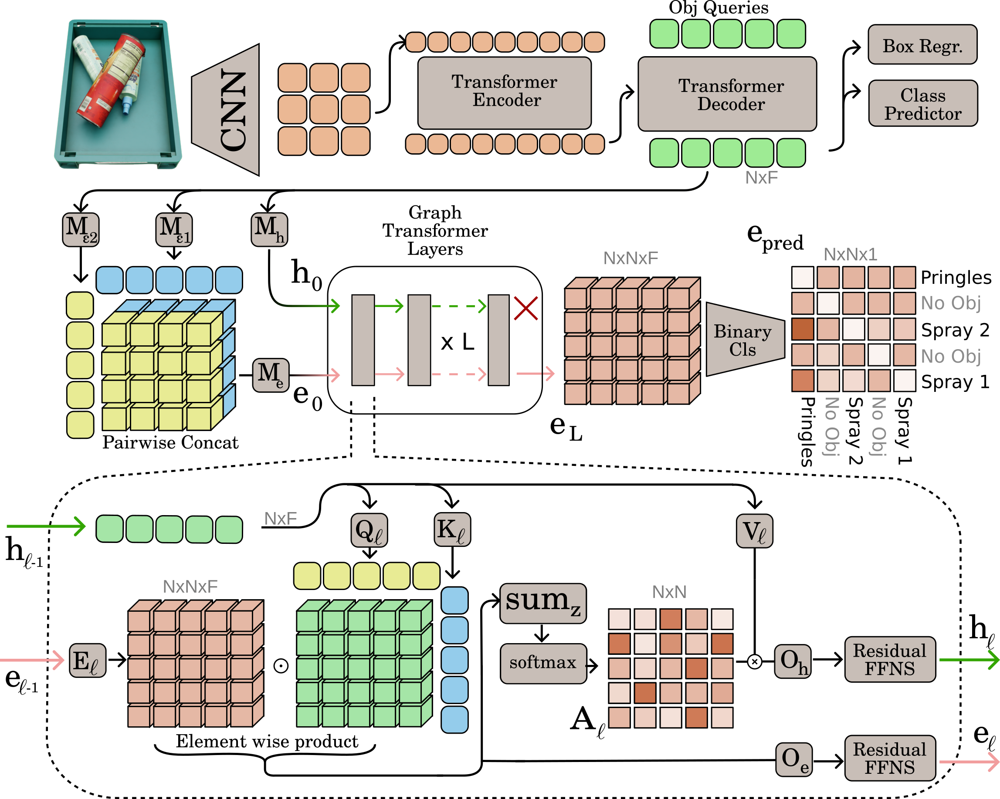

# D3G
This is the code for the paper "A Modern Take on Visual Relationship Reasoning for Grasp Planning"


##  D3GD Data
We base our test-bed on the MetaGraspNetV2 dataset, download from [here](https://github.com/maximiliangilles/MetaGraspNet) the **MGN-Sim** and **MGN-Real** data and put both of them in the same folder.

We also provide splits and compressed meta-data for our testbed [here](https://drive.google.com/drive/folders/1e9_Oa05Cdt5K4aa3rRRf__t5l5ozUeZf?usp=drive_link), download all files and put them in the ```d3g/data/``` folder

## Installation
For installing the environment create a fresh python env and run the following command
```
pip install -r requirements.txt
```
If you want to run deformable detr models run the following

```
cd ./models/deformable_detr_modules/ops
sh ./make.sh
python ./test.py
```

## Run experiments and define new ones
We leverage [detectron2](https://detectron2.readthedocs.io/en/latest/) config systems to define experiments and models, to launch one simply run
```
python main.py --config-file configs/config.yaml --data-path /your/data/path
```
create a new .yaml file in the config folder to create new experiments

### Pretraining
For all reported experiments we first pretrain the detection part of the model on the detection task and then fine-tune/train the complete model on the detection and relationship understanding tasks.
To pretrain models run the pretrain configs as follows

```
# Depending on your desired model run one of the following 

# Detr based Models
python main.py --config-file ./configs/pretrains/detr_pretrain.yaml

# Deformable Detr based models
python main.py --config-file ./configs/pretrains/defdetr_pretrain.yaml

# Mask-RCNN based models
python main.py --config-file ./configs/pretrains/rcnn_pretrain.yaml

```
For all models we start from the publicly avaiable COCO checkpoints, due to our changes to the detr and deformable detr architectures we need to change some key names, pretrain checkpoints with fixed keys are avaiable [here](https://drive.google.com/drive/folders/1v9XdnxK1eKCYFYpilOSpm3zOi3BycMqY?usp=drive_link)
### Relationship Reasoning Training
Now that you have your pretrained model you can train it on the relationship reasoning task as follows
```
python main.py --config-file detr_graphdense_medium.yaml MODEL.WEIGHTS /path/to/checkpoint 
```
### Citation
If you find this work usefull please cite it using:
```
@article{rabino2024relationshipreasoning,
      title={A Modern Take on Visual Relationship Reasoning for Grasp Planning},
      author={Paolo Rabino and Tatiana Tommasi},
      journal={arXiv preprint arXiv:2409.02035},
      year={2024} 
}
``` 